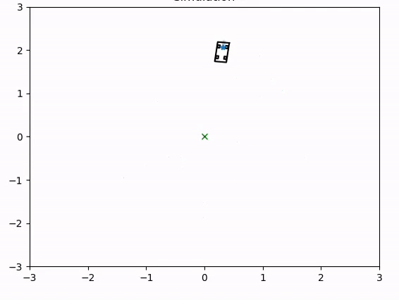
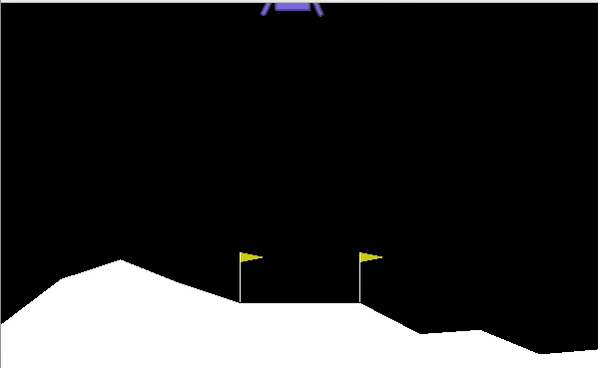

# Reinforcement-Learning-with-CLF-s

This project contains code for some RL implementations where a Control Lyapunov Function is added on the reward function to accelerate the training process. This project also contains MATLAB code for computing Control Lyapunov Functions using Hamilton-Jacobi Reachability analysis. Read the full paper here. 

Here, we show the trajectories of the different RL implementations done with our method. 

<table>
  <tr>
    <td style="height: 10px;">1. Dubins Car Trajectory </td>
    <td style="height: 10px;">2. Lunar Lander</td>
  </tr>
  <tr>
    <td valign="top"></td>
    <td valign="top"></td>
  </tr>
 </table>

<table>
  <tr>
   <td style="height: 10px;">3. Drone Landing (Left):xz plane (Right): y</td>  
  </tr>
  <tr>
    <td valign="top"></td>
  </tr>
 </table>
 

## Paper Abstract

A significant challenge in reinforcement learning (RL) algorithms is that they suffer from high sample complexity, translating into long computation times. This study introduces a fusion of control theory and RL to find policies of autonomous systems with relatively few training episodes. Leveraging Hamilton-Jacobi Reachability, we compute a Decomposed Control Lyapunov Function (DCLF) that encapsulates system stability and uses it as part of the reward function in RL, which we show improves RL performance. We also extend prior work by constructing Lyapunov functions for high-dimensional systems, mitigating the curse of dimensionality on a particular class of dynamical systems. Through multiple examples, including a 12-dimensional drone, we demonstrate the effectiveness of this approach, where we learned a policy faster and with less data than standard RL algorithms. 

## Dependencies 
- gym - 0.18.0 
- numpy - 1.19.5 
- matplotlib - 3.3.4 
- pytorch - 1.8.1 

## Implementation 

### Constructing CLF

- `src/Reachability_CLVF` contains the code in MATLAB necessary for computing Lyapunov functions using Reachability. 
- ToolboxLS contains the code for using Level Set methods to obtain solutions for Hamilton-Jacobi partial differential equations. For more information on how to use this toolbox, see [here](https://www.cs.ubc.ca/~mitchell/ToolboxLS/)
- helperOC-master has integrated functions to facilitate using the Toolbox
- SystemDecomposition contains different examples for using our method to compute DCLF using system decomposition. Run `/src/Reachability_CLVF/System Decomposition/Dubins Car CLVF/main_dubins.m` to visualize the CLF for a Dubins Car example.

### Reinforcement Learning 

In `src/` there are two folders for running our approach on a Dubins Car example and the Lunar Lander environment from OpenAI. Run `src/dubins_model_gymenv/dubins_CLF.py to see a demo of the Dubins Car trajectory after training.

## Contact 
For any questions on using this code, do not hesitate to contact Antonio Lopez at [alopezz@utexas.edu](mailto:alopezz@utexas.edu) or open an issue.

